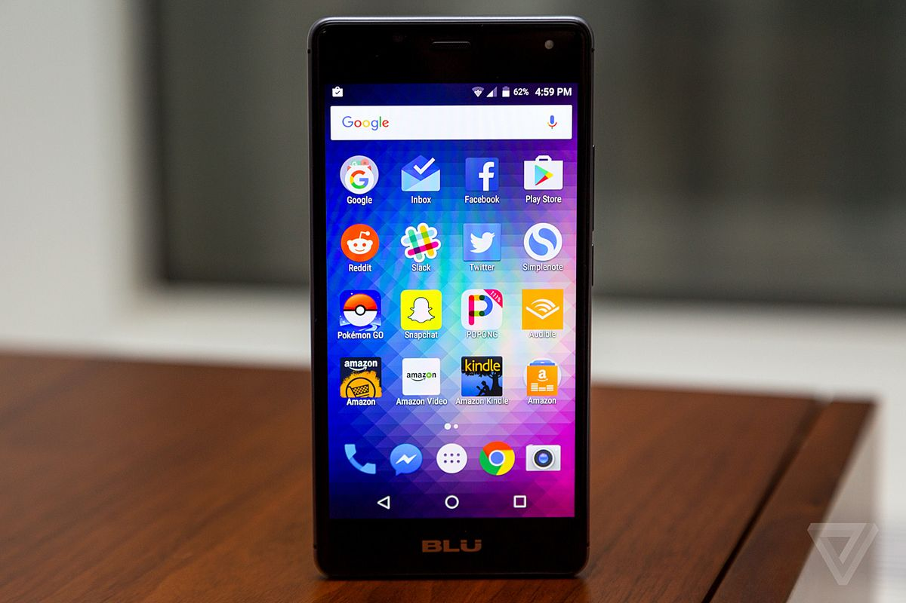
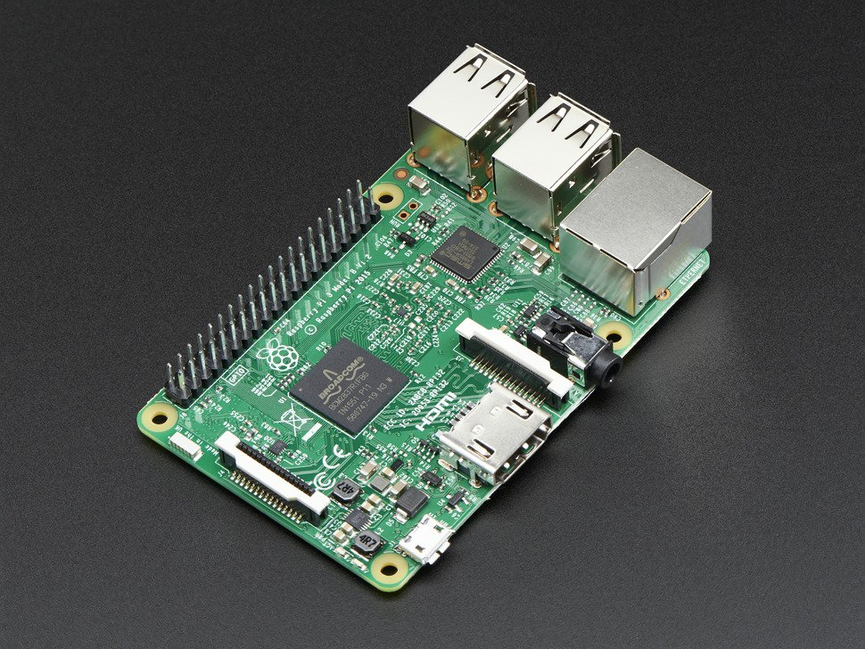
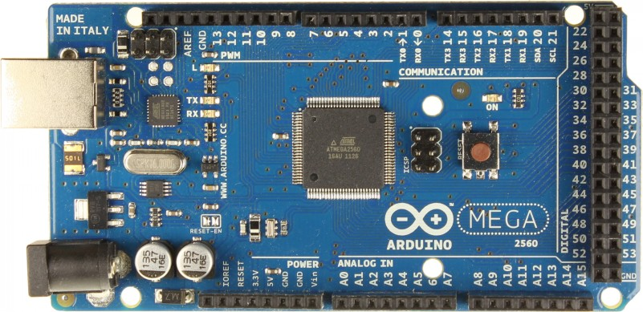
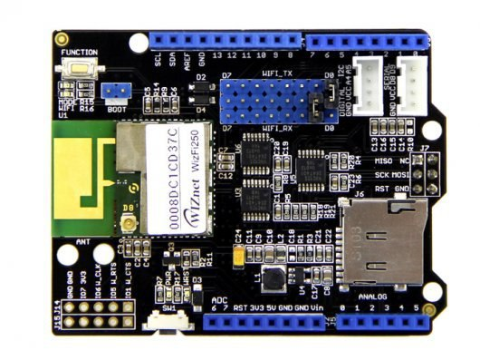
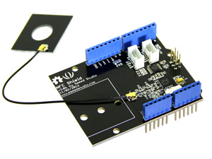

# Lightning Talk

---

### A little bit about myself

My name is **Olaf Szmidt**
I'm a **3rd** year CS UOM student
I enjoy programming =)

---

### What's my project?

- **Attendance Taking System for Lectures and Laboratories**
  - A replacement for the current method with a newly designed improved one.

---

### Importance of attendance management

- Able to give support to individuals before it's too late.
  - It can show correlation with students'  educational success 

---

### Current system - and what's wrong with it?

- It requires a lot of manual labour.
- Laboratory system differs from lectures greatly.

---

### Definition of attendance

Lecture attendance might be different than laboratory attendance.

---

### What's in my mind then?

Handheld devices being passed around the lecture hall or laboratory, where
each student scans it with their student card.

### What hardware do I need?

- Low  energy  consuption.
- Portable.
- Easy to develop on.
- Cheap.
- NFC and WifI enabled, or compatible with external NFC and WiFI addons.

+++

Too expensive.

+++

Too power hungry.

+++

Incompatible with NFC and WifI

+++

Arduino Uno + Seeed NFC shield + Seeed WiFI shield

